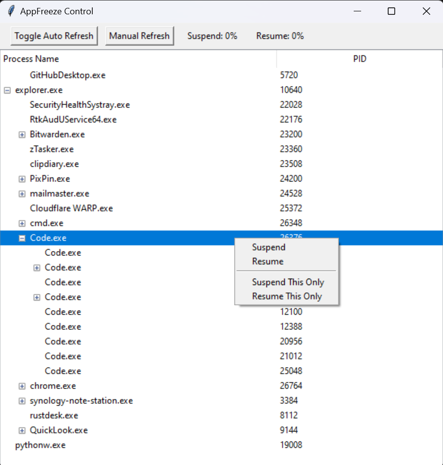

# AppFreeze Control

AppFreeze Control is a powerful tool for managing and controlling running applications on your system. With this application, you can easily suspend and resume processes, offering fine-grained control over your system's resources. It's particularly useful for gamers, IT professionals, and power users who need to manage resource-heavy applications or troubleshoot processes without terminating them.

# Features



- Suspend and Resume Applications:

- Suspend this Application Only: Pause a specific application, freeing up system resources temporarily.

- Resume this Application Only: Restart a suspended application, restoring its functionality.

- Suspend and Resume Entire Process Trees:

- Suspend All Subprocesses: Suspend a parent process along with all its child processes in one go.

- Resume All Subprocesses: Resume a parent process and all its child processes simultaneously.

- Manual and Auto Refresh:

- Manual Refresh: Refresh the process list at your convenience.

- Auto Refresh: Toggle automatic refreshing of the process list to keep it up-to-date without manual intervention.

- Process Hierarchy Display:

- Visualize processes in a hierarchical tree structure, showing parent and child relationships.

- Customizable Tree View:

- Processes are displayed in an easy-to-navigate tree view with expandable and collapsible nodes.

# Use Cases

- Resource Management: Temporarily suspend resource-intensive applications to improve system performance for more critical tasks.

- Debugging and Troubleshooting: Suspend applications to inspect their state without terminating them, making it easier to debug issues.

- Process Control: Easily manage background processes, suspending those that are not immediately necessary.

- Performance Optimization: Control system performance by prioritizing important tasks and suspending less critical applications.

- Safeguard Important Processes: Ensure critical applications have the resources they need by suspending other less important processes.

# Installation

1. Clone the Repository:

```bash
git clone https://github.com/jeffreyouni/appfreeze-control.git
cd appfreeze-control
```

2. Install Dependencies:

- Ensure you have Python 3.8 or later installed.

- Install the required Python packages:

```bash
pip install psutil tkinter
```

# Usage

1. Run the Application:

- Start the application by running the following command:

```bash
python main.py
```

2. Interact with the Process Tree:

- Right-click on any process in the tree view to bring up the context menu.

- Choose Suspend or Resume to control the process.

- Use the Manual Refresh button to update the process list.

- Toggle Auto Refresh for continuous updates.

# Contributing

We welcome contributions to improve AppFreeze Control! Please feel free to submit issues, feature requests, or pull requests.

1. Fork the repository

2. Create a new branch

3. Make your changes

4. Submit a pull request

# License

This project is licensed under the MIT License - see the LICENSE file for details.

# Acknowledgments

- PsSuspend by Sysinternals for process suspension and resumption.

- Tkinter for the GUI framework.

# Disclaimer

Use this tool responsibly. Suspending critical system processes may lead to system instability.