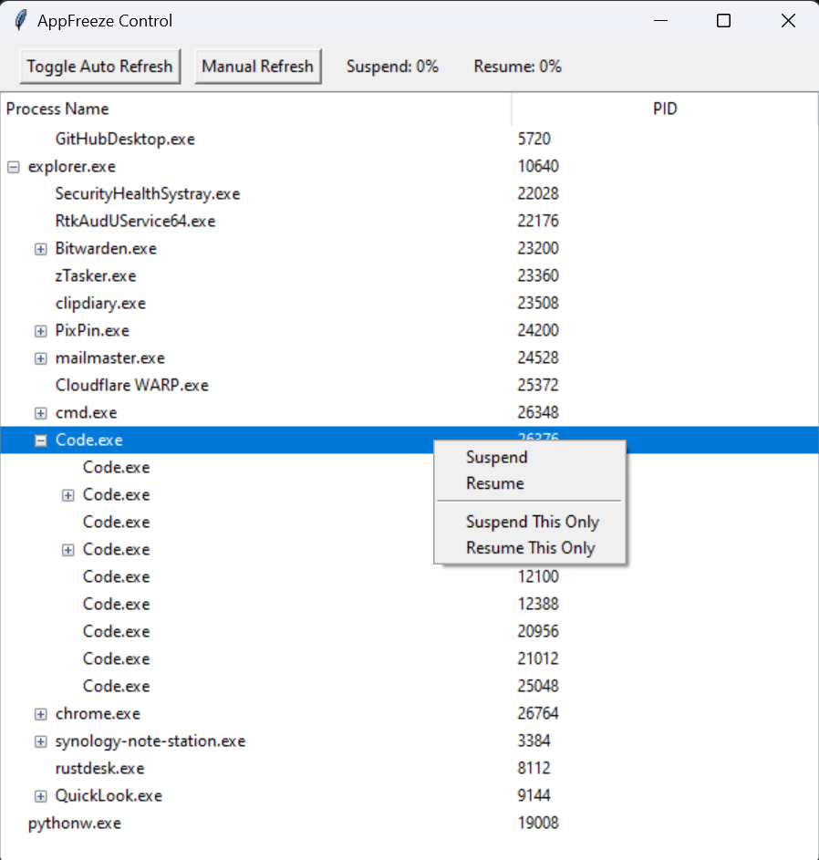

[English](./README.md)

# AppFreeze 控制

AppFreeze 控制是一个强大的工具，用于管理和控制系统上运行的应用程序。通过这个应用程序，您可以轻松地暂停和恢复进程，从而对系统资源进行细致的控制。它特别适合游戏玩家、IT专业人员和需要管理资源密集型应用程序或在不终止进程的情况下进行故障排除的高级用户。

# 功能



- 暂停和恢复应用程序：

- 仅暂停此应用程序：暂停特定应用程序，临时释放系统资源。

- 仅恢复此应用程序：重新启动已暂停的应用程序，恢复其功能。

- 暂停和恢复整个进程树：

- 暂停所有子进程：一次性暂停一个父进程及其所有子进程。

- 同时恢复所有子进程：同时恢复一个父进程及其所有子进程。

- 手动和自动刷新：

- 手动刷新：在您方便的时候刷新进程列表。

- 自动刷新：切换进程列表的自动刷新，以保持其最新状态，无需手动干预。

- 进程层级显示：

- 以层级树结构可视化进程，显示父子关系。

- 可自定义的树视图：

- 以易于导航的树视图显示进程，具有可展开和可折叠的节点。

# 使用案例

- 资源管理：暂时挂起资源密集型应用程序，以提高系统性能，便于处理更关键的任务。

- 调试和故障排除：挂起应用程序以检查其状态，而不终止它们，从而更容易调试问题。

- 进程控制：轻松管理后台进程，挂起那些不立即必要的进程。

- 性能优化：通过优先处理重要任务并挂起不太重要的应用程序来控制系统性能。

- 保护重要进程：通过挂起其他不太重要的进程，确保关键应用程序拥有所需的资源。

# 安装

1. 克隆仓库：

```bash
git clone https://github.com/jeffreyouni/appfreeze-control.git
cd appfreeze-control
```

2. 安装依赖：

- 确保您已安装 Python 3.8 或更高版本。

- 安装所需的 Python 包：

```bash
pip install psutil tkinter
```

# 使用

1. 运行应用程序：

- 通过运行以下命令启动应用程序：

```bash
python main.py
```

2. 与进程树交互：

- 右键单击树视图中的任何进程以弹出上下文菜单。

- 选择挂起或恢复以控制进程。

- 使用手动刷新按钮更新进程列表。

- 切换自动刷新以获取持续更新。

# 贡献

我们欢迎对 AppFreeze Control 的贡献！请随时提交问题、功能请求或拉取请求。

1. Fork 该仓库

2. 创建一个新分支

3. 进行更改

4. 提交拉取请求

# 许可证

本项目采用 MIT 许可证 - 详细信息请参见 LICENSE 文件。

# 致谢

- Sysinternals 的 PsSuspend 用于进程的挂起和恢复。

- Tkinter 用于 GUI 框架。

# 免责声明

请负责任地使用此工具。挂起关键系统进程可能导致系统不稳定。